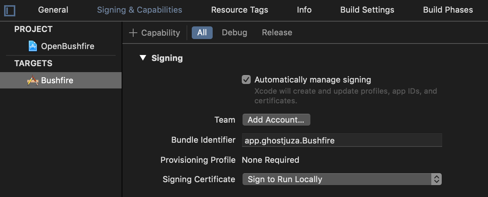

# Free Open-Source App to protect your privacy on any macOS Browser Safari

## Status

The app is pretty stable.  
Currently it runs up to macOS Mojave.

## Quick Links

Website: [bushfire-app.com](https://www.bushfire-app.com), [bushfire-app.de](https://www.bushfire-app.de)  
Twitter: [bushfireapp](https://twitter.com/bushfireapp)  

## Contributing

Here's a [list of issues](https://github.com/ghostjuza/open-bushfire/issues) where your help would be very welcome.

### Important notes for pull requests

* work on the right branch: it must be `develop` for new features and `master` for hotfixes
* please respect existing style in code, styles, and markup
* don't add any dependencies
* write good code
* test your code
* refactoring welcome

## Compile the App

* you need Apple's Xcode `;)`
* config your app signing  

## Donations

Bushfire is not free to develop. It takes time, requires paid certificates and domains.  
You can help the project or say "thank you" with this button:

Please note: donation does not imply any type of service contract.

## License

Bushfire.app - A free Open-Source App to protect your privacy on any macOS Browser Safari.

Copyright (c) Open Bushfire Community. All rights reserved.

This program is free software: you can redistribute it and/or modify
it under the terms of the GNU General Public License as published by
the Free Software Foundation, either version 3 of the License, or
(at your option) any later version.

This program is distributed in the hope that it will be useful,
but WITHOUT ANY WARRANTY; without even the implied warranty of
MERCHANTABILITY or FITNESS FOR A PARTICULAR PURPOSE. 
See the GNU General Public License for more details.

[GPL3](https://github.com/ghostjuza/open-bushfire/blob/master/LICENSE)

## Special Thanks

@Alexander Gärtner, Sponsor

### Libraries

software update framework [Sparkle](https://sparkle-project.org)  
